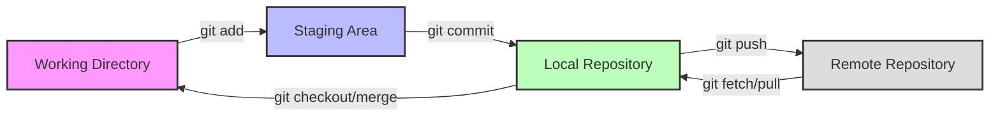
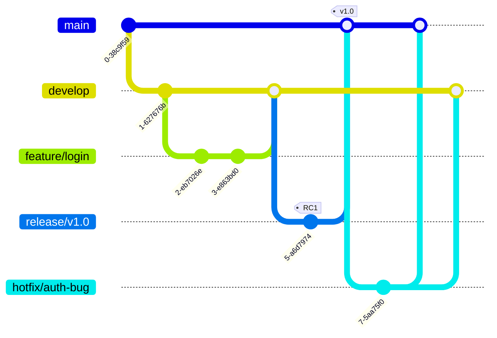
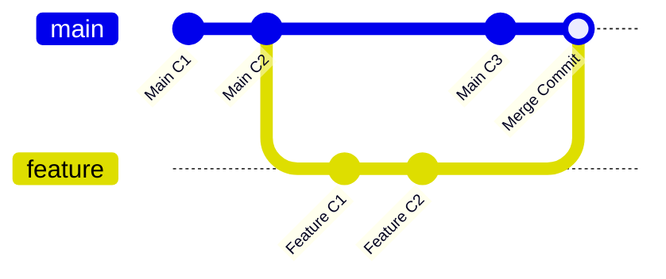
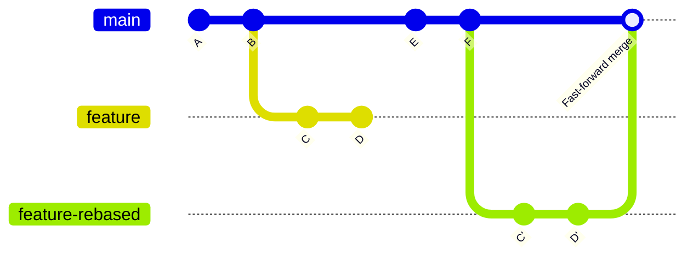

> *A comprehensive guide to understanding version control architectures, implementing robust branching models, and deploying self-hosted GitLab environments for modern development teams.*

In the modern landscape of software engineering, Git has transcended its role as a mere tool; it is the fundamental fabric of collaboration. Whether you are a solo developer managing a side project or a DevOps engineer orchestrating pipelines for a Fortune 500 company, understanding the nuances of Git is non-negotiable.

However, many developers stop at `git add`, `git commit`, and `git push`. To truly leverage the power of version control, one must understand the underlying architecture, the psychology of branching strategies, and the infrastructure that supports it all. This article dives deep into the mechanics of Git, compares industry-standard workflows, and provides a technical guide to hosting your own GitLab instance.

---

## 1. The Anatomy of a Git Workflow

To master Git, you must first visualize the movement of data. Unlike centralized version control systems, Git relies on a distributed model with three distinct local states before code ever reaches a remote server.

### The Three States
Git is aware of file changes the moment they happen, but it does not automatically track them. This distinction is crucial for understanding the "safety net" Git provides.

1.  **Working Directory:** The sandbox where you edit files. Changes here are "untracked."
2.  **Staging Area (Index):** A preparation zone. You explicitly choose which changes are ready to be saved. This allows you to break massive edits into logical, atomic commits.
3.  **Local Repository (Committed):** The database where snapshots of your project history are stored.

Once a file is committed, it is safe. It is a "save point" in your development history. Only after this local lifecycle is complete do we introduce the **Remote Repository** (like GitHub or GitLab).



### Remote vs. Local
The disconnect between local and remote is a feature, not a bug. It allows developers to work offline, experiment freely, and rewrite history without affecting the team until they are ready to `push`.

---

## 2. Fundamentals of Git Collaboration

Collaboration introduces complexity. When multiple engineers modify the same codebase, entropy increases. Managing this chaos requires strict adherence to protocol.

### Resolving Conflicts
Conflicts are not errors; they are requests for human intervention. They occur when Git cannot determine which change is authoritative—usually when two people edit the same line of code.

When a conflict arises during a merge or rebase, Git pauses. You must manually edit the file to select the correct code, remove the conflict markers (`<<<<<<`, `======`, `>>>>>>`), and commit the resolution.

### Common Pitfall: The Untracked Pull
A frequent scenario involves two users, User A and User B. User A pushes a change. User B, having made local changes to the same file but not yet committed them, tries to `git pull`.

Git will abort this operation to prevent overwriting User B's work. You have two choices:
1.  **The Destructive Route:** If your local changes are garbage, wipe them:
    ```bash
    git reset --hard
    git pull origin master
    ```
2.  **The Safe Route:** Stash or commit your changes first, then pull, then resolve the resulting conflict:
    ```bash
    git commit -am "WIP: saving local changes"
    git pull origin master
    # Resolve conflict here
    git commit -am "Resolved merge conflict"
    ```

### The Danger of Forced Pushes
The command `git push --force` (or `-f`) is the nuclear option. It overwrites the remote history with your local history. If a colleague has pushed code that you don't have, a forced push will **delete their work permanently**.

**Rule of Thumb:** Never force push to a shared branch (like `master` or `develop`) unless you are the repository maintainer and you have communicated with the team.

---

## 3. Configuration and Best Practices

A clean repository is a sign of a mature team. Enforcing hygiene through configuration prevents technical debt.

### Line Endings (CRLF vs. LF)
This is the classic "It works on my machine" problem. Windows uses Carriage Return + Line Feed (`CRLF`) to mark the end of a line. Unix/Linux/Mac uses just Line Feed (`LF`). If mixed, your diffs will look like the entire file has changed.

Standardize this using `core.autocrlf`:

*   **Windows Users:**
    ```bash
    git config --global core.autocrlf true
    ```
*   **Mac/Linux Users:**
    ```bash
    git config --global core.autocrlf input
    ```

### The Art of the Commit Message
Avoid the command line for commit messages (`git commit -m "fix"`). It encourages brevity where detail is needed. Configure Git to open your preferred editor, forcing you to pause and write a descriptive title and body.

```bash
# For VS Code
git config --global core.editor "code --wait"
# For Vim
git config --global core.editor "vim"
```

### The .gitignore File
Your repository should only contain source code. Logs, build artifacts, node_modules, and environment variables must be excluded. A well-structured `.gitignore` handles this.

```gitignore
# Ignore specific file
.env

# Ignore directories
node_modules/
dist/

# Ignore all files of a type
*.log
```

---

## 4. Branching Strategies

A branching strategy is the ruleset your team follows to merge code. Choosing the right one depends on your release cadence and team size.

### Trunk-Based Development (TBD)
In TBD, developers merge small, frequent updates to a single central branch (usually `main` or `trunk`).

*   **Pros:** Reduces "merge hell," enforces Continuous Integration, ideal for fast-paced web apps.
*   **Cons:** Requires high test coverage; if the build breaks, everything stops.

### Git Flow
Git Flow is a strict branching model designed around project releases. It assigns specific roles to branches.

*   **Master:** Production-ready code only.
*   **Develop:** The integration branch for the next release.
*   **Feature Branches:** Branched off `develop`, merged back into `develop`.
*   **Release Branches:** Prepares `develop` for `master`.
*   **Hotfix Branches:** Patches `master` directly.



### Which to choose?

| Feature | Trunk-Based | Git Flow |
| :--- | :--- | :--- |
| **Branching** | Single long-lived branch | Multiple long-lived branches |
| **Deployment** | Continuous / Daily | Scheduled Releases |
| **Complexity** | Low | High |
| **Best For** | SaaS, Web Apps, Startups | Packaged Software, Enterprise |

---

## 5. Advanced Workflows: Forking and Rebasing

### The Forking Workflow
Forking is not a Git command; it is a hosting provider feature (GitHub/GitLab). It creates a server-side copy of a repository. This is standard for Open Source contributions.

To work effectively with a fork, you must configure an **upstream** remote to keep your fork synchronized with the original project.

```bash
# Add the original repo as 'upstream'
git remote add upstream https://github.com/OriginalOwner/Repo.git

# Fetch latest changes
git fetch upstream

# Merge upstream changes into your local master
git merge upstream/master master
```

### Merge vs. Rebase
The first thing to understand about git rebase is that it solves the same problem as git merge. Both of these commands are designed to integrate changes from one branch into another branch—they just do it in very different ways.

Let considering about the following scenario. You are working in a new feature branch, and your team mate is going to change the main branch with his new commit. So in order to incorporate the new commits into your feature branch, you have two options: merging or rebasing.

1.  **Merge (`git merge main`):** Creates a "merge commit." It preserves history exactly as it happened, chronologically.
    *   *Result:* A non-destructive, truthful history, but can look messy with "railroad tracks."

2.  **Rebase (`git rebase main`):** Rewrites history. It lifts your feature commits and places them *after* the latest main commits.
    *   *Result:* A perfectly linear history.
    *   *Warning:* Never rebase a branch that others are working on. You are rewriting commits they may have already pulled.


#### Merge Strategy



#### Rebase Strategy



---

## 6. Infrastructure: Hosting Your Own GitLab

For teams requiring total control over their code and CI/CD pipelines, self-hosting GitLab on Ubuntu is a powerful solution. Here is a streamlined guide to getting a production-ready instance running.

### Prerequisites
*   **Server:** Ubuntu 20.04 or 22.04.
*   **Resources:** Minimum 4GB RAM (GitLab is resource-heavy).
*   **Domain:** A configured DNS record (e.g., `gitlab.yourdomain.com`).

### Step 1: Install Dependencies
Update your package manager and install the necessary tools, including Postfix for email notifications.

```bash
sudo apt-get update
sudo apt-get install -y curl openssh-server ca-certificates postfix
```

### Step 2: Install GitLab EE (Enterprise Edition)
GitLab provides a convenience script to add their repository to your source list.

```bash
curl -sS https://packages.gitlab.com/install/repositories/gitlab/gitlab-ee/script.deb.sh | sudo bash
sudo apt-get install gitlab-ee
```

### Step 3: Configure URL and Let's Encrypt
Before the first run, edit the configuration file to define your domain and enable SSL.

```bash
sudo nano /etc/gitlab/gitlab.rb
```

Modify the following lines:
```ruby
external_url 'https://gitlab.yourdomain.com'
letsencrypt['contact_emails'] = ['admin@yourdomain.com']
```

### Step 4: Initialize and Firewall
Reconfigure GitLab to apply the changes. This process triggers a Chef run that sets up Nginx, Postgres, and Redis.

```bash
sudo gitlab-ctl reconfigure
```

Ensure your firewall allows traffic:
```bash
sudo ufw allow https
sudo ufw allow http
sudo ufw allow OpenSSH
```

### Step 5: First Login
GitLab generates a temporary root password. Retrieve it to log in for the first time:

```bash
sudo cat /etc/gitlab/initial_root_password
```
*Note: This file deletes itself after 24 hours. Change your password immediately via the UI.*

---

## Conclusion

Git is more than a command-line utility; it is a system of logic that governs how we build software together. By understanding the mechanical flow of data from working directory to remote, adhering to clean commit practices, and selecting the appropriate branching strategy for your team size, you reduce friction and increase deployment velocity.

Whether you are resolving a complex rebase conflict or provisioning a private GitLab server, the principles remain the same: **Communication, consistency, and control.** 

Mastering these workflows transforms Git from a source of frustration into your team's most powerful asset.

## More Information
- [Git for team](https://gist.github.com/YushinB/a0126351255b7574d843aaffad60d823)