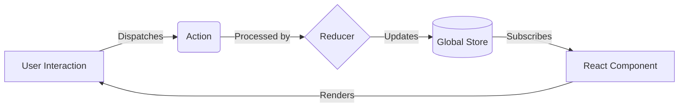
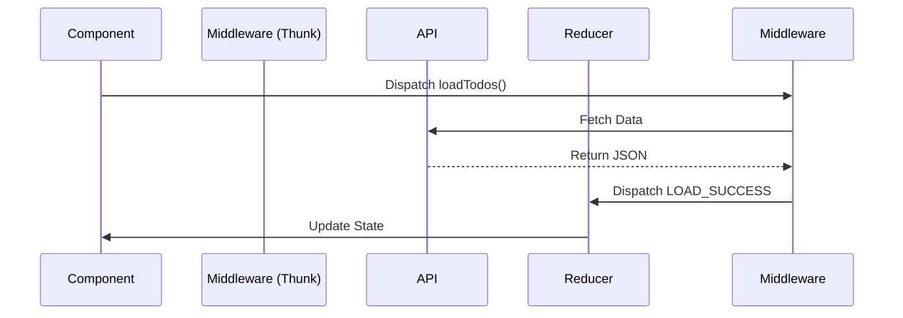

<figure class="figure">
  
  <figcaption class="figure-caption">Centered image with caption</figcaption>
</figure>


> *Building a scalable front-end requires more than just a UI library. It requires an ecosystem. Here is a deep dive into building a maintainable, high-performance architecture using React, Redux, Webpack, and Styled-Components.*

React is rarely used in a vacuum. While the library itself is brilliant at rendering views, a production-grade application requires a robust supporting cast to handle state management, side effects, styling, and build processes. 

To build an application that scales, we must understand the "React Ecosystem"—a collection of tools that, when orchestrated correctly, create a seamless development experience and a performant user experience.

In this guide, we will architect a React application from the ground up, bypassing `create-react-app` to understand the underlying mechanics of **Webpack**, implementing the **Redux** unidirectional data flow, managing side effects with **Thunks**, optimizing with **Reselect**, and styling with **Styled-Components**.

---

## Part 1: The Foundation (Webpack and Babel)

Before writing a single line of component logic, we must establish the build environment. React code relies heavily on ES6+ syntax and JSX (JavaScript XML), neither of which browsers understand natively. We need a translator and a bundler.

### The Entry Point
Every React application begins with a simple HTML file. This is the canvas upon which React will paint the UI. We need a `public` folder containing an `index.html` file with a specific "root" `div`.

```html
<!DOCTYPE html>
<html>
<head>
    <meta charset="UTF-8" />
    <meta name="viewport" content="width=device-width, initial-scale=1, shrink-to-fit=no">
    <title>React Ecosystem</title>
</head>
<body>
    <div id="root"></div>
    <noscript>Please enable JavaScript to view this site.</noscript>
    <script src="../dist/bundle.js"></script>
</body>
</html>
```

### Configuring Webpack
Webpack is the engine that compiles our JavaScript modules. It takes our dependency tree and bundles it into a single file (or chunks) that the browser can load.

To set this up, we install the necessary loaders:
```bash
npm install --save-dev webpack webpack-cli webpack-dev-server style-loader css-loader babel-loader
```

The `webpack.config.js` file is the blueprint for this process. It tells Webpack:
1.  **Entry:** Where to start looking (usually `src/index.js`).
2.  **Rules:** How to transform files (e.g., using Babel for `.js` files, Style Loader for `.css`).
3.  **Output:** Where to spit out the compiled `bundle.js`.
4.  **DevServer:** How to serve the app locally with Hot Module Replacement (HMR).

Here is a robust configuration for a modern React setup:

```javascript
const path = require("path");
const webpack = require("webpack");

module.exports = {
  entry: "./src/index.js",
  mode: "development",
  module: {
    rules: [
      {
        test: /\.(js|jsx)$/,
        exclude: /(node_modules)/,
        loader: "babel-loader",
        options: { presets: ["@babel/env"] },
      },
      {
        test: /\.css$/,
        use: ["style-loader", "css-loader"],
      },
    ],
  },
  resolve: { extensions: ["*", ".js", ".jsx"] },
  output: {
    path: path.resolve(__dirname, "dist/"),
    publicPath: "/dist/",
    filename: "bundle.js",
  },
  devServer: {
    static: path.join(__dirname, "public/"),
    port: 3000,
    devMiddleware: {
      publicPath: "https://localhost:3000/dist/",
    },
    hot: "only",
  },
  plugins: [new webpack.HotModuleReplacementPlugin()],
};
```

With **React Hot Loader**, we can reflect code changes in the browser without losing the application state, significantly speeding up the development cycle.

---

## Part 2: State Management with Redux

As applications grow, passing data via "props drilling" (passing data down through multiple layers of components) becomes unmanageable. Redux solves this by providing a single source of truth: the **Store**.

### The Unidirectional Data Flow
Redux operates on a strict unidirectional data flow, often described by the Flux architecture.

1.  **Action:** An event triggered by a user or system.
2.  **Dispatcher:** Sends the action to the store.
3.  **Reducer:** A pure function that calculates the new state based on the action.
4.  **View:** The UI updates to reflect the new state.



### Implementing Redux Toolkit
Historically, Redux required significant boilerplate. Today, we use **Redux Toolkit (RTK)**, which simplifies store configuration and reducer logic.

First, we create the store using `configureStore`. We will also implement **Persistence** immediately. A common pitfall in Single Page Applications (SPAs) is data loss on page refresh. By using `redux-persist`, we can save our store to `localStorage` automatically.

```javascript
// src/store.js
import { combineReducers, configureStore } from "@reduxjs/toolkit";
import { persistReducer, persistStore } from "redux-persist";
import storage from "redux-persist/lib/storage";
import autoMergeLevel2 from "redux-persist/lib/stateReconciler/autoMergeLevel2";
import { todos } from "./todos/reducers";

const reducers = {
  todos,
};

const persistConfig = {
  key: "root",
  storage,
  stateReconciler: autoMergeLevel2,
};

const rootReducer = combineReducers(reducers);
const persistedReducer = persistReducer(persistConfig, rootReducer);

// Configure store with serializableCheck disabled for redux-persist compatibility
export const store = configureStore({
  reducer: persistedReducer,
  middleware: (getDefaultMiddleware) =>
    getDefaultMiddleware({
      serializableCheck: false,
    }),
});

export const persistor = persistStore(store);
```

Finally, we wrap our application in the `Provider` and `PersistGate` in our entry file. This injects the state into the React component tree.

```javascript
// src/index.js
import React from "react";
import ReactDOM from "react-dom/client";
import { Provider } from "react-redux";
import { PersistGate } from "redux-persist/integration/react";
import { store, persistor } from "./store";
import App from "./App";

const root = ReactDOM.createRoot(document.getElementById("root"));
root.render(
  <Provider store={store}>
    <PersistGate loading={<div>Loading...</div>} persistor={persistor}>
      <App />
    </PersistGate>
  </Provider>,
);
```

### Debugging with Redux DevTools
One of the strongest arguments for using Redux is the tooling. The **Redux DevTools** extension allows you to time-travel through your state changes. You can inspect every action payload and see exactly how the state tree changed in response.

---

## Part 3: Managing Side Effects with Thunks

Redux Reducers must be **pure functions**. This means for a given input, they must always return the same output, without side effects (like API calls or routing).

So, where do we put our API logic?

We use **Redux Thunk**.

### How Thunks Work
A "Thunk" acts as a middleware that sits between the dispatched action and the reducer. It allows you to write action creators that return a function instead of an action object. This function can perform asynchronous operations and *then* dispatch a regular synchronous action.



Here is a practical example of a Thunk handling a network request:

```javascript
export const loadTodos = () => async (dispatch, getState) => {
    try {
        dispatch({ type: 'LOAD_TODOS_IN_PROGRESS' });
        
        const response = await fetch('http://localhost:8080/todos');
        const todos = await response.json();
    
        dispatch({
            type: 'LOAD_TODOS_SUCCESS',
            payload: { todos },
        });
    } catch (e) {
        dispatch({ type: 'LOAD_TODOS_FAILURE' });
        displayAlert(e);
    }
};
```

By using Thunks, we keep our UI components clean. The component simply calls `loadTodos()`, completely unaware of the complexity of network requests or error handling occurring in the background.

---

## Part 4: Optimization with Reselect

As our state tree grows, performance can degrade. If we perform complex calculations inside `mapStateToProps`, those calculations run every time the store updates—even if the relevant data hasn't changed.

**Reselect** allows us to create **memoized selectors**.

### The Power of Memoization
Memoization is a technique where the result of a function call is cached. If the inputs ($x, y$) are the same as the previous call, the function returns the cached result instead of recalculating.

$$ f(x) \rightarrow \text{result} \quad (\text{cached}) $$
$$ f(x) \rightarrow \text{return cached result} $$

Using `createSelector` from Redux Toolkit (or the reselect library), we can build efficient data pipelines.

```javascript
import { createSelector } from "@reduxjs/toolkit";

// Input Selectors
const getTodos = (state) => state.todos.data;

// Memoized Output Selector
export const getIncompleteTodos = createSelector(
  [getTodos],
  (todos) => todos.filter((todo) => !todo.isCompleted)
);
```

In this example, `getIncompleteTodos` will only re-run the filter logic if `state.todos.data` has changed. If another part of the state changes (e.g., a user profile update), this selector simply returns the cached array, saving valuable processing cycles.

---

## Part 5: Styled-Components

For years, developers struggled with maintaining massive CSS files, global namespace collisions, and the disconnect between logic and styling. **Styled-Components** introduces the concept of CSS-in-JS.

By using tagged template literals, we can write actual CSS code inside our JavaScript files. This scopes the style to the specific component, preventing side effects.

### Dynamic Styling
The real power of Styled-Components is the ability to adapt styles based on props.

Consider a Todo item that needs to display a red border if it is overdue. Instead of toggling class strings, we pass props directly to the style definition:

```javascript
import styled from 'styled-components';

const TodoItemContainer = styled.div`
  background: #fff;
  border-radius: 8px;
  /* Dynamic logic inside CSS */
  border-bottom: ${(props) =>
    new Date(props.createdAt) > new Date(Date.now() - 8640000 * 5)
      ? "none"
      : "2px solid red"};
  
  padding: 16px;
  box-shadow: 0 4px 8px grey;
`;
```

This approach treats styling as a function of state, adhering closer to the React philosophy than traditional CSS classes ever could.

---

## Part 6: Testing the Ecosystem

A robust architecture is useless if it breaks easily. Testing in the React ecosystem requires a multi-layered strategy. We use **Mocha** and **Chai** for the test runner and assertions, along with **Sinon** for mocking.

### 1. Testing Reducers
Reducers are the easiest to test because they are pure functions. We simply assert that `State + Action = New State`.

```javascript
import { expect } from 'chai';
import { todos } from '../reducers';

describe('The todos reducer', () => {
    it('Adds a new todo when CREATE_TODO action is received', () => {
        const fakeTodo = { text: 'hello', isCompleted: false };
        const fakeAction = {
            type: 'CREATE_TODO',
            payload: { todo: fakeTodo },
        };
        const originalState = { isLoading: false, data: [] };

        const expected = { isLoading: false, data: [fakeTodo] };
        const actual = todos(originalState, fakeAction);

        expect(actual).to.deep.equal(expected);
    });
});
```

### 2. Testing Thunks
Testing Thunks is trickier because they involve async operations. We use `sinon` to spy on the dispatch function and `fetch-mock` to simulate server responses.

```javascript
import fetchMock from "fetch-mock";
import { expect } from "chai";
import sinon from "sinon";
import { loadTodos } from "../thunks";

describe("The loadTodos thunk", () => {
  it("Dispatches success action after fetching data", async () => {
    const fakeDispatch = sinon.spy();
    const fakeTodos = [{ text: "1" }, { text: "2" }];
    
    // Mock the API endpoint
    fetchMock.get("http://localhost:8080/todos", fakeTodos);

    // Execute the thunk
    await loadTodos()(fakeDispatch);

    // Assertions
    const expectedAction = {
      type: "LOAD_TODO_SUCCESS",
      payload: { todos: fakeTodos },
    };

    // Check if the second dispatch call was the success action
    expect(fakeDispatch.getCall(1).args[0]).to.deep.equal(expectedAction);
    
    fetchMock.reset();
  });
});
```

### 3. Testing Selectors
To test Reselect selectors without setting up a massive fake state tree, we can use the `.resultFunc` property. This allows us to test the transformation logic of the selector directly, passing in raw data rather than the full Redux state.

```javascript
import { expect } from "chai";
import { getCompletedTodos } from "../selectors";

describe("The getCompletedTodos Selector", () => {
  it("Return only completed todos", () => {
    const fakeTodos = [
      { text: "A", isCompleted: true },
      { text: "B", isCompleted: false },
    ];

    const expected = [{ text: "A", isCompleted: true }];
    
    // Test the logic directly
    const actual = getCompletedTodos.resultFunc(fakeTodos);

    expect(actual).to.deep.equal(expected);
  });
});
```

---

## Conclusion

Building a modern React application is about making architectural choices that favor scalability and maintainability. 

By manually configuring **Webpack**, we gain control over our build process. By adopting **Redux Toolkit**, we ensure predictable state management. **Thunks** allow us to separate complex logic from our UI, while **Reselect** ensures that logic remains performant. Finally, **Styled-Components** modernize how we approach visual design, and a rigorous **Testing** strategy ensures our application remains stable as it grows.

These tools, when used together, form a cohesive ecosystem that empowers developers to build world-class web applications.