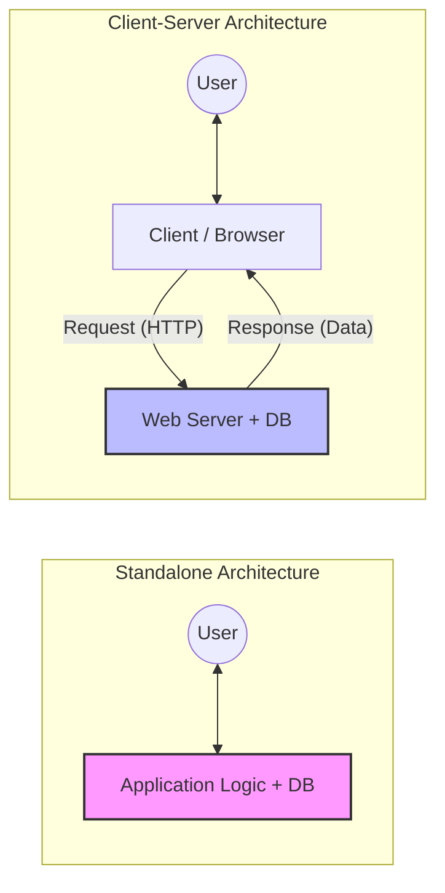
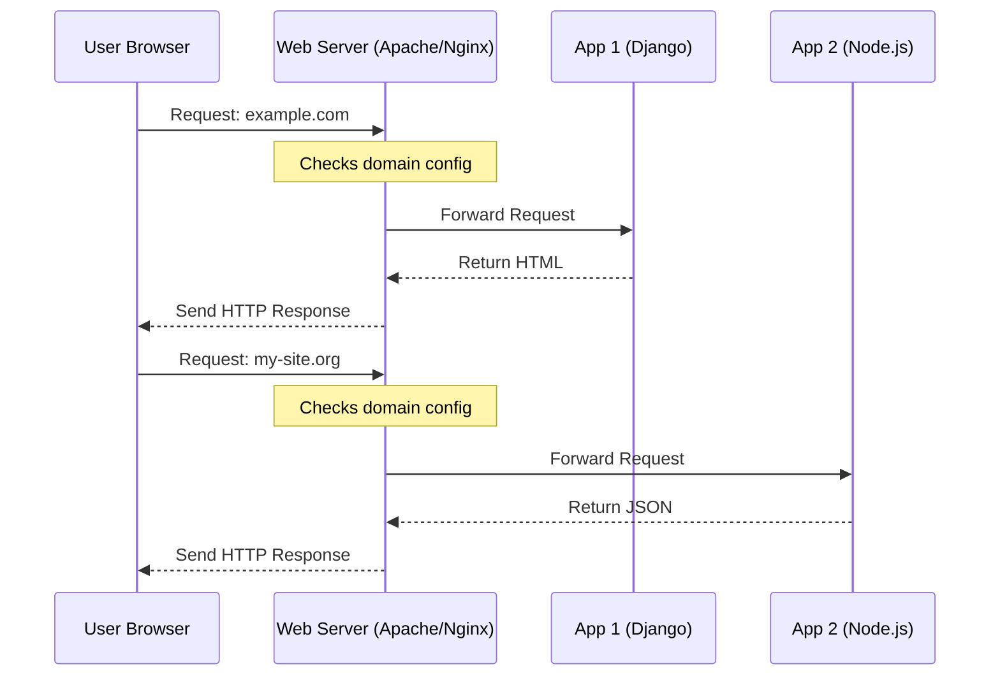
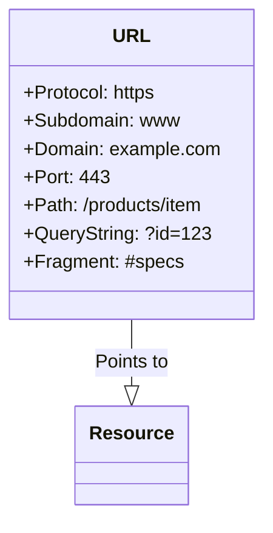

> Understanding the invisible structures that power our digital lives—from the humble URL to complex client-server ecosystems.

In the modern digital landscape, we often take the software we use for granted. We tap an icon, a page loads, or a calculation finishes. But beneath that seamless user interface lies a complex ecosystem of architectural decisions, communication protocols, and server hierarchies. Whether you are a budding developer or a product manager, understanding the fundamental types of applications and how they communicate is not just technical trivia—it is the literacy of the 21st century.

This guide explores the anatomy of software architecture, moving from isolated standalone programs to the dynamic, interconnected world of web servers and frameworks.

---

## 1. The Great Divide: Application Types

Before we talk about the internet, we must understand where software lives. Broadly speaking, applications fall into two primary categories based on their architecture: **Standalone** and **Client-Server**.

### The Standalone Application
The standalone application is the solitary introvert of the software world. It is software that does not require a network connection to function. It is installed locally on a machine, and all its logic, data storage, and interface rendering happen on that single device.

Think of the classic Calculator app, Microsoft Word (the offline version), or a PC video game from the 1990s.
*   **Pros:** High performance (no network latency), security (data stays on the device), and reliability (works offline).
*   **Cons:** Difficult to update (users must download patches), hard to share data, and data is liable to be lost if the hardware fails.

### The Client-Server Application
This is the architecture that powers the modern web. It splits the application into two distinct parts:
1.  **The Client:** The interface the user interacts with (e.g., a web browser or a mobile app).
2.  **The Server:** A powerful remote computer that processes logic and stores data.

In this model, the client sends a **Request**, and the server returns a **Response**. This architecture allows for centralized data management. If you update your profile picture on Instagram (Client A), your friend sees it immediately on their phone (Client B) because both clients are talking to the same Server.

Here is a visualization of how these architectures differ:

### Two-Tier vs. Three-Tier Architecture
Within the Client-Server model, we often see a further breakdown.
*   **Two-Tier:** The client talks directly to the database server. This is rare in modern web apps due to security risks.
*   **Three-Tier:** The industry standard.
    1.  **Presentation Tier:** The User Interface.
    2.  **Application Tier:** The Logic (The "Server").
    3.  **Data Tier:** The Database.

---

## 2. The Server: The Digital Backbone

When we say "Server," we are often referring to two things simultaneously: the **Hardware** (the physical machine) and the **Software** (the program listening for requests).

In the context of web development, a server is a software program designed to serve files or data to a client. It operates on a "listen and respond" basis. It sits quietly, listening to a specific **Port** (usually port 80 for HTTP or 443 for HTTPS), waiting for a knock on the door.

### The Responsibility of the Server
The server is the guardian of resources. Its job is to:
1.  **Authenticate:** Verify who is asking.
2.  **Process:** Execute the necessary business logic.
3.  **Retrieve:** Pull data from a database if needed.
4.  **Respond:** Send the result back to the client.

If we were to express the server's efficiency mathematically, where $R$ is the total response time, $L$ is network latency, and $P$ is server processing time:

$$ R = 2L + P $$

Optimizing a server involves minimizing $P$ through efficient code and database queries, as $L$ is often determined by the physical distance between the user and the data center.

---

## 3. Web Frameworks vs. Web Servers

One of the most common points of confusion for junior developers is the difference between a **Web Server** and a **Web Framework**. They work in tandem, but they have very different jobs.

### The Web Framework: The Chef
A Web Framework helps you develop the application code. It provides the tools, libraries, and structure to write the logic. It handles routing (figuring out what URL does what), database interactions, and template rendering.
*   *Examples:* Django (Python), Spring Boot (Java), Express (Node.js), Ruby on Rails.

### The Web Server: The Restaurant Manager
The Web Server hosts that application. It handles the incoming traffic, manages network connections, handles SSL encryption, and serves static files (images, CSS) efficiently. It acts as a reverse proxy, sitting in front of your application code.
*   *Examples:* Apache HTTP Server, Nginx, IIS.

### The Hosting Relationship
Crucially, a single Web Server can host **many** different applications simultaneously. It uses "Virtual Hosts" to route traffic based on the domain name requested.

This architecture allows for efficient resource usage. Instead of needing a separate physical machine for every website, one robust Web Server can manage traffic for dozens of different frameworks running in the background.

---

## 4. Static vs. Dynamic Websites

Not all websites are created equal. The way content is delivered to the user divides the web into two eras: the Static era and the Dynamic era.

### Static Websites: The Digital Brochure
A static website consists of pre-written files. It is made up of HTML, CSS, and JavaScript.
*   **Storage:** Each page is stored as a single, physical file on the server (e.g., `about.html`).
*   **Delivery:** When a user requests the page, the server simply reads the file from the hard drive and sends it exactly as is.
*   **Immutability:** The content does not change unless a developer manually edits the code and re-uploads the file.
*   **Use Case:** Portfolios, landing pages, documentation, brochures.

### Dynamic Websites: The Conversation
A dynamic website is built using server-side languages (PHP, Python, Java). The pages do not exist until the user asks for them.
*   **Generation:** When a request comes in, the server builds the page "on-the-fly." It might check who the user is, look up their last orders in a database, and insert that data into an HTML template.
*   **Interactivity:** This allows for user-generated content. Your Facebook feed is a dynamic page; it looks different for you than it does for me, even though we are visiting the same URL.

### Comparison

| Feature | Static Website | Dynamic Website |
| :--- | :--- | :--- |
| **Content** | Fixed, same for everyone | Personalized, changes based on user |
| **Speed** | Extremely fast (simple file transfer) | Slower (requires processing time) |
| **Complexity** | Low (HTML/CSS) | High (Database + Server Logic) |
| **Security** | High (No database to hack) | Lower (Vulnerable to injection attacks) |

---

## 5. The Apache HTTP Server

No discussion on web architecture is complete without mentioning the **Apache HTTP Server**. Launched in 1995, Apache played a key role in the initial growth of the World Wide Web.

Apache is free, open-source software that delivers web content. It is renowned for its:
*   **Modularity:** You can load modules to add features (like security, caching, or URL rewriting) without rewriting the core software.
*   **Reliability:** It powers a significant portion of the internet's active websites.
*   **Compatibility:** It is the "A" in the famous **LAMP** stack (Linux, Apache, MySQL, PHP/Python/Perl), which became the blueprint for open-source web development.

While newer servers like Nginx have gained popularity for their event-driven architecture (handling high concurrency better), Apache remains the gold standard for flexibility and configuration via `.htaccess` files, allowing developers to configure server behavior on a per-directory basis.

---

## 6. The URL: The Address of the Web

Finally, how do we find these servers and applications? We use the **URL** (Uniform Resource Locator).

A URL is more than just a web address; it is a specific instruction set for the browser. In theory, every valid URL points to a unique resource. However, because the web is dynamic, resources move, leading to the infamous "404 Not Found" error—the digital equivalent of a "Return to Sender" stamp.

### Anatomy of a URL
Let's dissect a standard URL: `https://www.example.com:443/path/to/file?search=query#section`

1.  **Protocol (`https`):** Tells the browser *how* to communicate. HTTP is standard; HTTPS is secure.
2.  **Domain (`www.example.com`):** The human-readable address of the server. DNS (Domain Name Systems) translates this into an IP address.
3.  **Port (`:443`):** The specific "door" on the server. (80 for HTTP, 443 for HTTPS). Browsers usually hide this.
4.  **Path (`/path/to/file`):** The specific resource or route within the application.
5.  **Parameters (`?search=query`):** Extra data sent to the server, often used for filtering lists or tracking.
6.  **Anchor (`#section`):** A bookmark meant for the browser to scroll to a specific part of the page. This part is never sent to the server.

## Conclusion

The transition from standalone desktop applications to the complex, interconnected web has revolutionized how we interact with information. We have moved from isolated silos of data to a world where **Web Servers** like Apache act as traffic controllers, managing requests for **Dynamic Websites** powered by sophisticated **Web Frameworks**.

Understanding these layers—from the syntax of a URL to the architecture of the server—provides the context needed to build better, faster, and more secure software. Whether the website is a static HTML file or a complex AI-driven platform, the underlying principles of the request-response cycle remain the heartbeat of the internet.