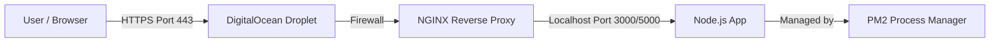

> A comprehensive walkthrough on deploying a Node.js application to a DigitalOcean VPS using PM2 for process management, NGINX as a reverse proxy, and Let's Encrypt for free SSL certificates.

There is a massive chasm between "it works on my machine" and "it works on the internet."

For many developers, the development process is comfortable. You have your IDE, your local database, and your trusted `localhost:3000`. But when it comes time to show the world what you’ve built, the landscape changes. You move from a controlled environment to the wild west of the public web.

You need a server. You need a way to keep the app alive if it crashes. You need to handle domain names, route traffic efficiently, and most importantly, you need to secure that traffic with HTTPS.

In this guide, we are going to set up a production-ready architecture. We won't just run a script; we will build a robust stack using **Ubuntu**, **PM2**, **NGINX**, and **Let's Encrypt**.

Here is the architecture we are building:



---

## 1. Infrastructure Setup: The VPS

First, we need a computer that runs 24/7. In the cloud world, this is a Virtual Private Server (VPS). DigitalOcean calls them "Droplets."

1.  **Sign up for DigitalOcean.** If you don't have an account, you can use this referral link to get $100 in credit (valid for 60 days), which is plenty to test this setup: [DigitalOcean Referral](https://m.do.co/c/5424d440c63a).
2.  **Create a Droplet.** Select an **Ubuntu** image (LTS versions like 20.04 or 22.04 are best). The basic $4 or $6/month plan is usually sufficient for small Node.js applications.
3.  **Access the Server.** Once created, you will receive an IP address. Open your terminal and SSH into the server.

```bash
ssh root@your_droplet_ip
```

*Note: While we are using the root user for simplicity in this guide, for a serious production app, you should create a non-root user with `sudo` privileges for better security.*

---

## 2. Installing the Environment

Ubuntu comes with a version of Node.js in its default repositories, but it is often outdated. To ensure we have a modern, stable version, we will use the NodeSource repository.

In your terminal window (connected to your Droplet), run the following to install Node.js (we'll use version 18.x or 20.x as the modern standard, though the logic applies to any version):

```bash
# Download the setup script
curl -sL https://deb.nodesource.com/setup_18.x | sudo -E bash -

# Install Node.js and NPM
sudo apt install nodejs

# Verify installation
node --version
```

If you see a version number output, your environment is ready.

---

## 3. Deploying Your Code

There are several ways to move code to a server (FTP, SCP), but **Git** is the industry standard. It allows you to pull the exact version of your code that is currently on GitHub or GitLab.

1.  **Clone the repository:**
    ```bash
    git clone https://github.com/yourusername/yourproject.git
    ```

2.  **Install Dependencies:**
    Move into your project directory and install the libraries your app needs.
    ```bash
    cd yourproject
    npm install
    ```

3.  **Test the App:**
    Before we automate it, let's make sure it actually runs.
    ```bash
    npm start
    # OR
    node app.js
    ```
    If the app starts without errors, press `CTRL+C` to stop it. We know it works; now we need to make it robust.

---

## 4. Process Management with PM2

If you run `node app.js` and close your terminal window, your website dies. This is where **PM2** comes in. PM2 is a production process manager for Node.js that keeps your application alive forever, reloads it without downtime, and facilitates common system admin tasks.

**Install PM2 globally:**
```bash
sudo npm i pm2 -g
```

**Start your application:**
```bash
# Replace 'app.js' with your entry file (index.js, server.js, etc.)
pm2 start app.js
```

Your app is now running in the background. Here are a few essential PM2 commands to remember:

*   `pm2 status`: See the health of your running processes.
*   `pm2 logs`: Stream the logs to debug issues.
*   `pm2 restart app`: Restart the application.

**Persistence:**
We need to ensure the app restarts automatically if the server reboots. PM2 makes this incredibly easy:

```bash
pm2 startup ubuntu
```
Run the command that PM2 outputs, then save the current process list:
```bash
pm2 save
```

---

## 5. Configuring the Firewall (UFW)

Security is not optional. We need to configure the Uncomplicated Firewall (UFW) to ensure only the necessary doors are open to the outside world.

We want to block direct access to your Node port (e.g., 3000 or 5000) and force users to come through the standard web ports (80 and 443).

```bash
sudo ufw enable
sudo ufw allow ssh   # Port 22 - Don't lock yourself out!
sudo ufw allow http  # Port 80
sudo ufw allow https # Port 443
sudo ufw status
```

---

## 6. NGINX as a Reverse Proxy

This is the core of our deployment architecture. We aren't going to expose Node.js directly to the internet. Instead, we will use NGINX.

NGINX is faster at serving static files, handles SSL termination better, and adds a layer of security. It will sit in front of your app, accept traffic on port 80, and forward it to your Node app on port 3000 (or 5000).

**Install NGINX:**
```bash
sudo apt install nginx
```

**Configure the Proxy:**
We need to edit the default configuration file.
```bash
sudo nano /etc/nginx/sites-available/default
```

Find the `location /` block inside the `server` block and replace it with the configuration below. Be sure to replace `http://localhost:5000` with the actual port your Node app runs on.

```nginx
server_name yourdomain.com www.yourdomain.com;

location / {
    proxy_pass http://localhost:5000; # Change to your app's port
    proxy_http_version 1.1;
    proxy_set_header Upgrade $http_upgrade;
    proxy_set_header Connection 'upgrade';
    proxy_set_header Host $host;
    proxy_cache_bypass $http_upgrade;
}
```

**Test and Restart:**
Always test your NGINX config for syntax errors before restarting.
```bash
sudo nginx -t
sudo service nginx restart
```

At this point, if you navigate to your server's IP address in a browser, you should see your application running.

---

## 7. DNS Configuration

Accessing a website via an IP address (e.g., `192.168.1.1`) is not user-friendly. We need a domain name.

1.  **Register a Domain:** If you don't have one, Namecheap is a reliable registrar. [Use this link to check them out](https://namecheap.pxf.io/c/1299552/386170/5618).
2.  **Point Nameservers:** In your registrar's dashboard, set the "Custom Nameservers" to DigitalOcean's:
    *   `ns1.digitalocean.com`
    *   `ns2.digitalocean.com`
    *   `ns3.digitalocean.com`
3.  **DigitalOcean Networking:** Go to the Networking tab in your DigitalOcean dashboard. Add your domain.
4.  **Create Records:** Create two **A Records**:
    *   **Hostname:** `@` -> Directs to your Droplet.
    *   **Hostname:** `www` -> Directs to your Droplet.

*Note: DNS propagation can take anywhere from a few minutes to 24 hours.*

---

## 8. Securing with SSL (Let's Encrypt)

Finally, we need that green padlock. Google penalizes sites without SSL, and users don't trust them. Fortunately, **Certbot** allows us to obtain free certificates from Let's Encrypt and configures NGINX automatically.

**Install Certbot:**
```bash
sudo add-apt-repository ppa:certbot/certbot
sudo apt-get update
sudo apt-get install python3-certbot-nginx
```

**Generate the Certificate:**
```bash
sudo certbot --nginx -d yourdomain.com -d www.yourdomain.com
```

Certbot will ask if you want to redirect all HTTP traffic to HTTPS. **Select Yes (Option 2).** This ensures that anyone typing `yourdomain.com` is automatically upgraded to the secure version.

**Auto-Renewal:**
Let's Encrypt certificates last for 90 days. Certbot installs a timer to renew them automatically, but you can test it now:

```bash
certbot renew --dry-run
```

---

## Conclusion

Congratulations! You have successfully graduated from `localhost`.

You now have a Node.js application running on a dedicated server, managed by PM2 to ensure uptime, fronted by NGINX for performance and routing, and secured with an enterprise-grade SSL certificate.

This setup is the foundation of modern DevOps for Node.js. From here, you can explore CI/CD pipelines to automate the `git clone` and restart steps, or look into load balancing multiple droplets as your traffic grows.

Happy coding!